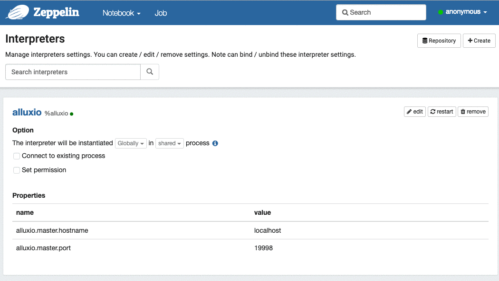
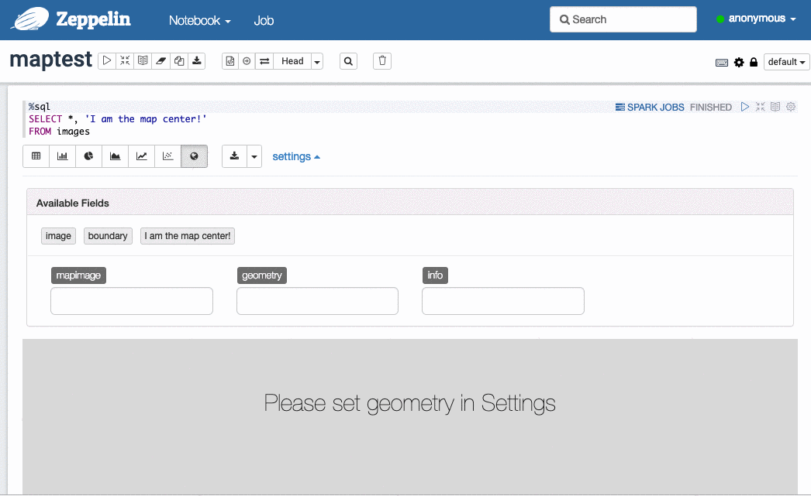

# Install Sedona-Zeppelin

!!!warning
	**Known issue**: due to an issue in Leaflet JS, Sedona can only plot each geometry (point, line string and polygon) as a point on Zeppelin map. To enjoy the scalable and full-fleged visualization, please use SedonaViz to plot scatter plots and heat maps on Zeppelin map.

## Compatibility

Apache Spark 2.3+

Apache Zeppelin 0.8.1+

Sedona 1.0.0+: Sedona-core, Sedona-SQL, Sedona-Viz

## Installation

!!!note
	You only need to do Step 1 and 2 only if you cannot see [Apache-sedona](https://www.npmjs.com/package/apache-sedona) or [GeoSpark Zeppelin](https://www.npmjs.com/package/geospark-zeppelin) in Zeppelin Helium package list.

### Create Helium folder (optional)
Create a folder called `helium` in Zeppelin root folder.

### Add Sedona-Zeppelin description (optional)

Create a file called `sedona-zeppelin.json` in this folder and put the following content in this file. You need to change the artifact path!

```
{
  "type": "VISUALIZATION",
  "name": "sedona-zeppelin",
  "description": "Zeppelin visualization support for Sedona",
  "artifact": "/Absolute/Path/incubator-sedona/zeppelin",
  "license": "BSD-2-Clause",
  "icon": "<i class='fa fa-globe'></i>"
}
```
	
### Enable Sedona-Zeppelin

Restart Zeppelin then open Zeppelin Helium interface and enable Sedona-Zeppelin.


### Add Sedona dependencies in Zeppelin Spark Interpreter



### Visualize SedonaSQL results


### Display SedonaViz results


Now, you are good to go! Please read [Sedona-Zeppelin tutorial](../tutorial/zeppelin.md) for a hands-on tutorial.
